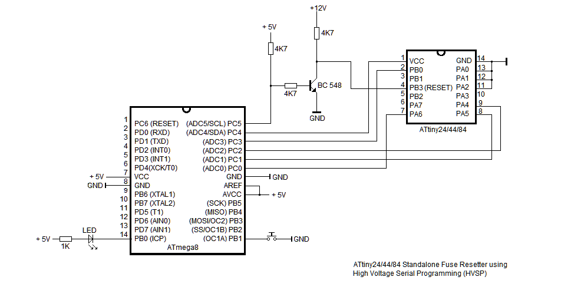
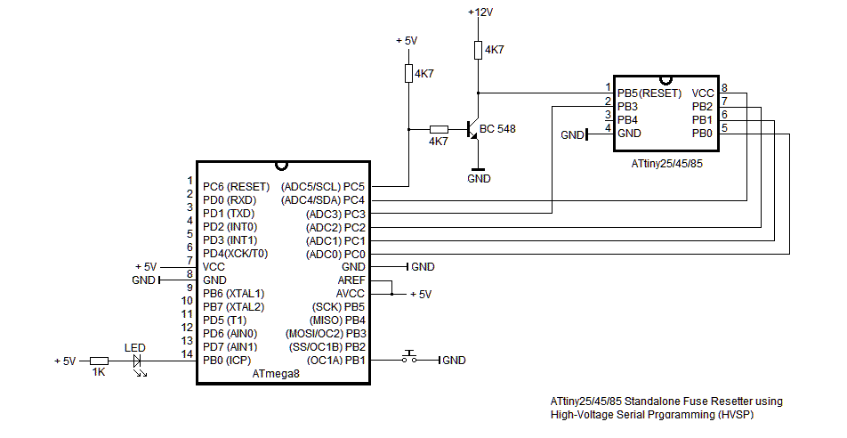

ATtiny Fuse Restore using HVSP
====

## Description

NOTICE:  
This project is a copy of the following site on github.
[ATtiny Fuse Restore using HVSP][]

Original:  
This project allows to reset fuses of ATtiny AVR to factory default values even 
in case ISP programming has been disabled or RESET has been configured as I/O pin.

On ATtiny microcontrollers, you can set the fuses to use the reset pin as a normal I/O pin,
this gives you another I/O pin. But this also disables its ability to reset the chip, 
as this is required to program the chip using ISP programming.
This circuit uses the High Voltage Serial Programming method (HVSP) to reset the fuses to factory default.

HVSP Fuse Restore circuit for ATtiny13, ATtiny25/45/85 (above) and for ATtiny24/44/84 (below) 

##Usage
First load the software into into the ATmega8 using your preferred  ISP programmer.  Then verify that +12V voltage supply is applied as well +5V supply. Then press button to start the fuse restore process.  When the led turns on constantly the fuses of the ATtiny have been successfully restored to factory default values. A flashing LED indicates the fuse restore was not successful.  

##Software
The AVR-GCC software runs unchanged on any ATmega8 or ATmega88/168/328, just adjust MCU type and clock frequency in the Makefile. The software can be easily adjusted to run on any AVR with at least 8 free I/O pins by changing the PORT and PIN definitions in the source file.

## Licence

* **[ATtiny Fuse Restore using HVSP][]**  
  by [Peter Fleury][]  
  GPLv2 or later  

## Author

  @ Copyright 2014 [Peter Fleury][]  

[ATtiny Fuse Restore using HVSP]: http://homepage.hispeed.ch/peterfleury/avr-hvsp-fuse-restore.html ""
[Peter Fleury]: http://tinyurl.com/peterfleury "Peter Fleury"
